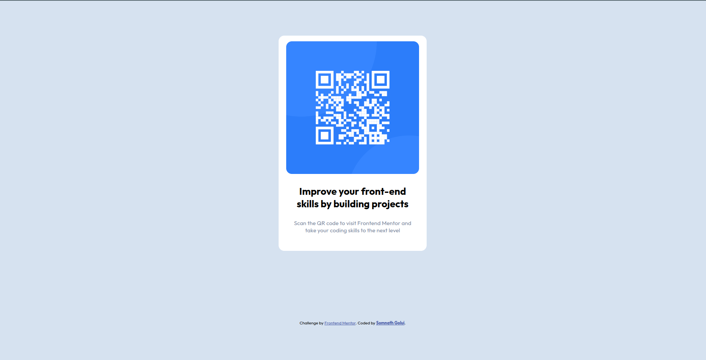

# Frontend Mentor - QR code component solution

This is a solution to the [QR code component challenge on Frontend Mentor](https://www.frontendmentor.io/challenges/qr-code-component-iux_sIO_H). Frontend Mentor challenges help you improve your coding skills by building realistic projects.

## Table of contents

- [Overview](#overview)
  - [Screenshot](#screenshot)
  - [Links](#links)
  - [Built with](#built-with)
- [Author](#author)

## Overview

QR code component

### Screenshot

Desktop View

Mobile View (width 375px)

### Links

- Solution URL: [Solution URL here](https://www.frontendmentor.io/solutions/qr-code-component-page-using-css-grid-and-flex-box-HEAX1zjvQm)
- Live Site URL: [Live site URL here](https://qr-code-component-3ou.pages.dev/)

### Built with

- Semantic HTML5 markup
- CSS custom properties
- Flexbox
- CSS Grid

## Author

- Frontend Mentor - [@somu-code](https://www.frontendmentor.io/profile/somu-code)
- Twitter - [@GoluiSomnath](https://www.twitter.com/GoluiSomnath)
